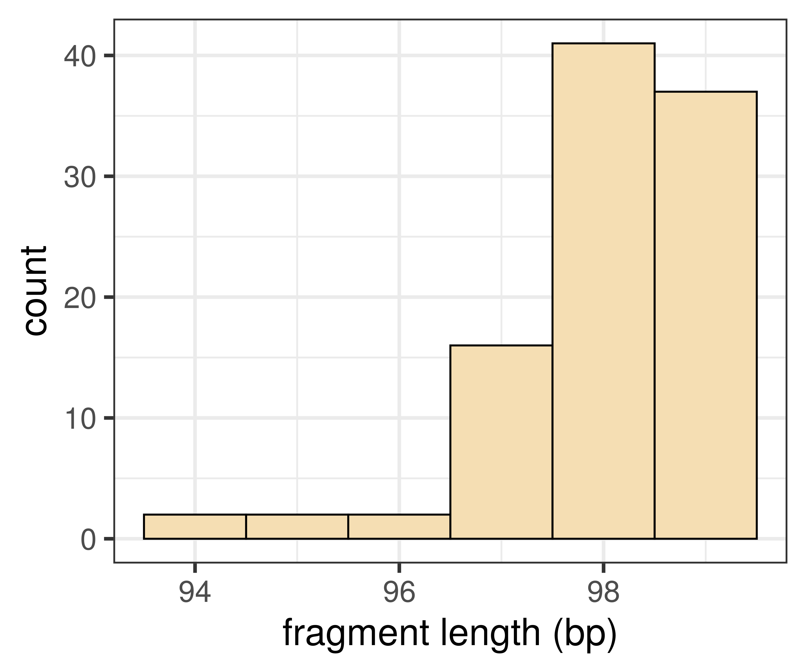
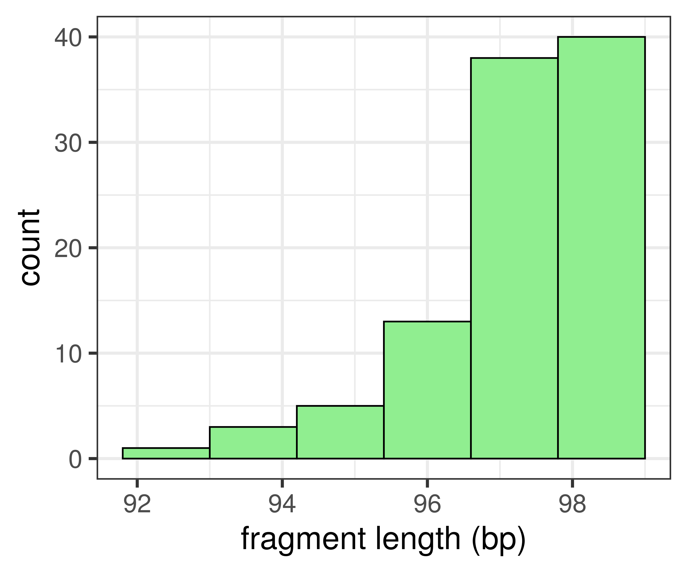

<!-- adding bold and italic options -->
<style>
em {
  font-style: italic
}
strong {
  font-weight: bold;
}
</style>

## In this lecture...

  >- Selecting the appropriate test
  >- Mann-Whitney U Test
  >- Generating and presenting histograms
  >- Computing and presenting statistical tests

--- .class #id

## Chi-squared tests

- Can be used for counts of categorical variables

### Chi-squared test of frequencies

- Test if the observed frequencies differ from the expected
- Useful in situations where we can predict frequencies under a particular set or rules or processes

### Chi-squared test of independence

- Test if the observed frequencies between two groups are different
- Expected frequencies can be unknown

--- .class #id

## What about quantitative and ordinal variables?

- Continuous and ordinal variables provide a quantification
- We may want to know if different groups differ in size or magnitude

### Continuous variable, normal distribution

- Parametric tests
- E.g. normally distributed data, 2 groups: t-test (week 32)

### Continuous variable, unknown or complex distribution

- Non-parametric test

### Ordinal variable

- Non-parametric test

--- .class #id 

## Non-parametric vs. parametric tests

- Make fewer assumptions on the underlying data
- Can be a "safer" option if some aspects of the data are unknown
- Lower statistical power (higher false negative rate)

### Used when a parametric test is not appropriate

--- .class #id 

## How does it work?

- Not parametric tests tend to be based on ranks
- Example: how fast can students and professors carry out an experiment?


Student

`10 10 20 21 27 45`

Professor

`15 16 32 33 35 37`

--- .class #id 

## How does it work?

- Not parametric tests tend to be based on ranks
- Example: how fast can students and professors carry out an experiment?

Student

`10 10 -- -- 20 21 27 -- -- -- -- 45`

Professor

`-- -- 15 16 -- -- -- 32 33 35 37 --`

--- .class #id 

## How does it work?

- Not parametric tests tend to be based on ranks
- Example: how fast can students and professors carry out an experiment?


Student

` 1  2 -- --  5  6  7 -- -- -- -- 12 = 33`

Professor

`-- --  3  4 -- -- --  8  9 10 11 -- = 45`

  >- Note the original times have been replaced
  >- So the distribution of the data is not important, just their order
  >- Because we convert the data to ranks, the methods are naturally suited to ordinal data

--- .class #id 

## Mann-Whitney U-Test

- Considered a non-parametric equivalent of the t-test
- 2 groups
- Ordinal or quantitative variable
- Observations must be independent

### Hypotheses

- Do values in one group tend to be larger/smaller than the other group?
- If the distributions are similar: are their medians different?

--- &twocol

## Mann-Whitney U-Test

Example: oxygen saturation for 2 groups of patients (N= 100 per group)


  
*** =left

**Group1**


```
## # A tibble: 100 x 1
##       O2
##    <dbl>
##  1    97
##  2    97
##  3    97
##  4    99
##  5    99
##  6    97
##  7    98
##  8    98
##  9    98
## 10    97
## # … with 90 more rows
```

*** =right

**Group2**


```
## # A tibble: 100 x 1
##       O2
##    <dbl>
##  1    98
##  2    97
##  3    96
##  4    96
##  5    98
##  6    98
##  7    96
##  8    97
##  9    97
## 10    98
## # … with 90 more rows
```

--- &twocol bg:white

## Mann-Whitney U-Test

Example: oxygen saturation for 2 groups of patients (N= 100 per group)

*** =left

**Group1**



*** =right

**Group2**



--- .class #id

## Mann-Whitney U-Test

Example: oxygen saturation for 2 groups of patients (N= 100 per group)

- Median Group 1 98% O2
- Median Group 2 97% O2
- Mann-Whitney U-test results: W = 7685, p-value = 5.6987877 &times; 10<sup>-12</sup>

--- &thankyou

## Next time

**What do you need to know?**
